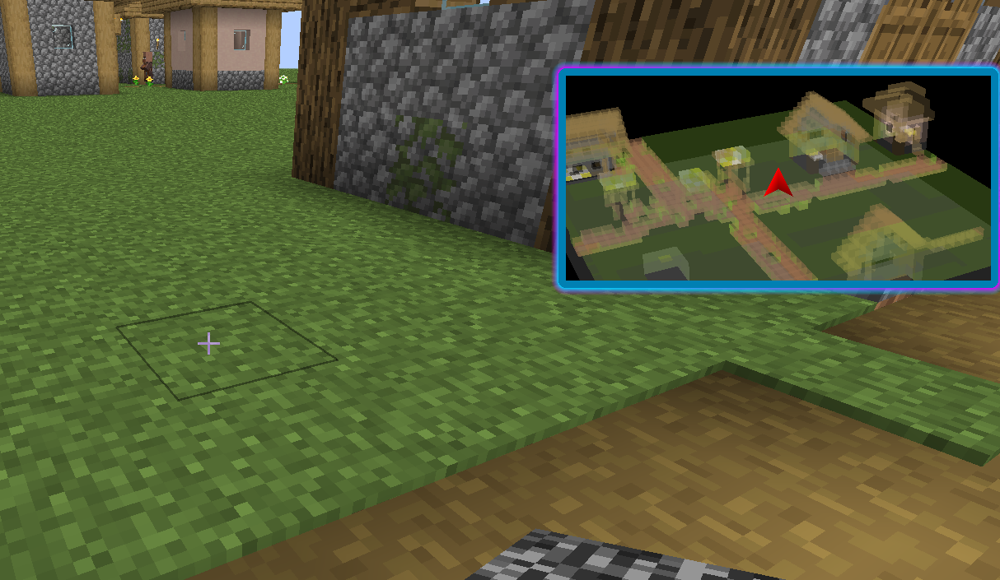
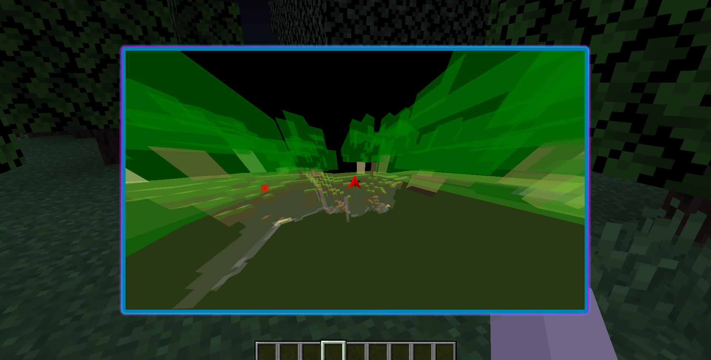

<h1 style="display:inline; vertical-align:middle; margin-left:10px;">Improper's 3D Minimap</h1>

---
Minimap but with 3D terrain! The keybind is `M`
 
[Download Latest Here](https://github.com/ItziSpyder/Impropers3DMinimap/releases/latest)

**You can also press `N` keybind to zoom in on the map:**

See entities on your radar with the targets selection in the menu!

Featuring two render modes:
- LINES - wireframe
- QUADS - filled voxels

You can also disable map coloring to color code block types!
- WHITE - non-full block
- GRAY - full block
- LIGHT_GRAY - same y-level as player
- GREEN - block entities

The hud can be dragged my clicking the `Edit Huds` button in the menu!
Your changes are saved in a config file located `.minecraft/config/impropers3DMinimap.json`

### Thanks for downloading my 3D Minihud!